# Zrnovar · case study e-shopu na Shopify (B2C a B2B)
Ing. Milan Kocáb · Product Owner / Project Manager · Praha

Testovací e-shop fiktivní pražírny kávy Zrnovar. Ukazuji na něm, co v Shopify nastavím sám, kdy sáhnu po aplikaci, kdy je potřeba vlastní vývoj a jak píšu zadání pro vývojáře.

Celé mi to zabralo zhruba 1,5 MD včetně seznámení se Shopify, nastavení obchodu, aplikací a napsání zadání. Do současnosti jsem pracoval pouze se Shoptetem.

## Rychlé odkazy

| Co | Kde |
|---|---|
| Obchod | [zrnovar.myshopify.com](https://zrnovar.myshopify.com/) |
| Heslo do obchodu | `magexo2026` |
| Zadání pro vývoj „Stálá objednávka pro B2B“ | [PDF](docs/zadani-stala-objednavka.pdf) · [Markdown](docs/zadani-stala-objednavka.md) |
| Kód slevové aplikace | [github.com/milankocab/zrnovar-slevy](https://github.com/milankocab/zrnovar-slevy) |

Zrnovar je fiktivní značka. Obchod slouží jen k ukázce, objednávky nejsou skutečné.

## Co e-shop umí

**B2C**
- Katalog kávy a příslušenství pro domácí přípravu.
- Automatická sleva „Ochutnej nový původ“ z vlastní aplikace postavené na Shopify Functions.
- Nativní slevové kódy. `DOPRAVA2026` na dopravu zdarma a naplánovaná sleva `BLACKFRIDAY`.
- Recenze produktů přes aplikaci Judge.me.
- Testovací platby přes Bogus Gateway.

**B2B**
- Firemní zákazník s vlastním ceníkem (B2B katalog Velkoobchod Gastro, −15 %).
- Platba na fakturu se splatností 30 dní.
- Minimální odběr a množstevní ceny přes pravidla množství v katalogu.

**Automatizace (Shopify Flow)**
- Upozornění, když zásoba produktu klesne pod 10 ks.
- Upozornění na B2B objednávku nad 5 000 Kč.

**Zadání pro další vývoj**
- Funkce „Stálá objednávka“ pro B2B zákazníky. Kavárna si uloží, co obvykle objednává, a objedná to jedním kliknutím. Zadání obsahuje user stories s akceptačními kritérii, okrajové případy, rozdělení na nastavení a vývoj a otázky pro vývoj i klienta.

## Vyzkoušejte si

### Sleva „Ochutnej nový původ“

Sleva odměňuje zákazníka, který si chce vyzkoušet víc druhů kávy.

- V košíku jsou alespoň 2 **různé** jednodruhové kávy (např. Brazílie Santos 250 g a Etiopie Yirgacheffe 250 g). Směsi se nepočítají.
- Sleva je 10 % na nejlevnější z nich.
- Víc kusů nebo variant stejné kávy se počítá jako jeden produkt.
- B2B zákazníci slevu nedostanou, mají vlastní ceník.

Sleva se naopak **neuplatní** u dvou kusů Brazílie Santos bez další kávy ani u kombinace Brazílie Santos a Espresso směs Kavárna.

## Co jsem nastavil a co nechal vyvinout

Nejdřív jsem hledal řešení přímo v Shopify, potom v App Store. Vlastní vývoj jsem volil, až když nic z toho požadavek nesplnilo.

| Funkce | Řešení | Proč |
|---|---|---|
| B2B ceník, platební podmínky, minimální odběr | Shopify (B2B) | Shopify to umí nativně a pravidla vynutí sám v pokladně. |
| Upozornění na zásoby a velké B2B objednávky | Shopify Flow | Jednoduchá pravidla bez kódu, nastavím je sám. |
| Recenze produktů | Aplikace Judge.me | Na ukázku stačila první doporučená aplikace, která pokryla, co jsem potřeboval. Na klientském projektu bych výběr řešil do hloubky s vývojáři a týmem. |
| Sleva „2 různé kávy“ | Vlastní vývoj (Shopify Functions) | Nativní slevy počítají kusy, ne různé produkty. Slevu by tak dostal i zákazník se třemi balíčky stejné kávy. |
| Stálá objednávka pro B2B | Vlastní vývoj (zatím zadání) | Shopify uloženou šablonu objednávky nemá a aplikace z App Store požadavky nesplnila. |

## Ukázky

### Pohled B2C zákazníka

**Sleva na dvě různé kávy.** V košíku je Mexiko bez kofeinu a Kolumbie Huila. Sleva „Ochutnej nový původ −10 %“ se automaticky uplatnila na levnější z nich, Kolumbie tak stojí 260,10 Kč místo 289 Kč.

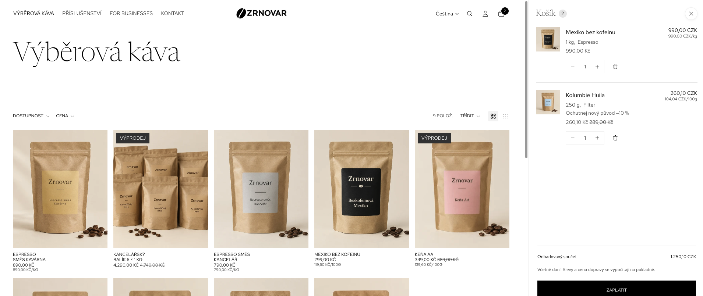

**Káva a směs bez slevy.** Espresso směs Kancelář a Bezkofeinové Mexiko. Směsi se do pravidla nepočítají, v košíku je tak jen jedna jednodruhová káva a sleva se neuplatní.

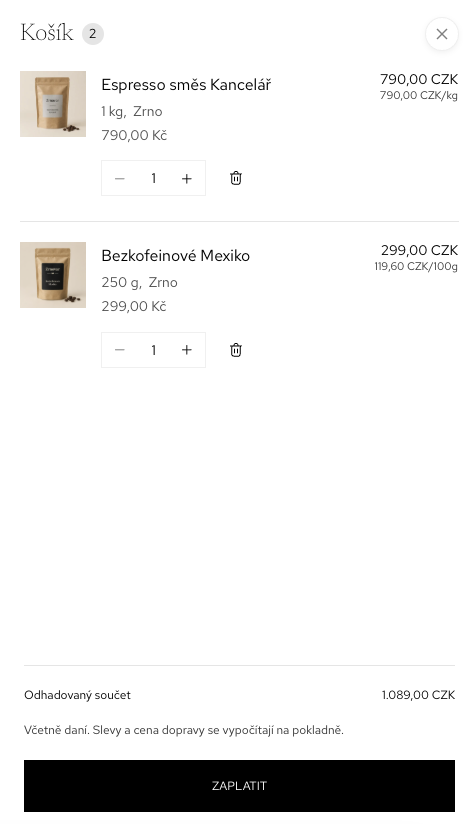

**Sleva v pokladně.** Sleva z košíku se přenese do pokladny. U levnější kávy je vidět původní cena, název slevy a ušetřená částka 29,90 Kč.

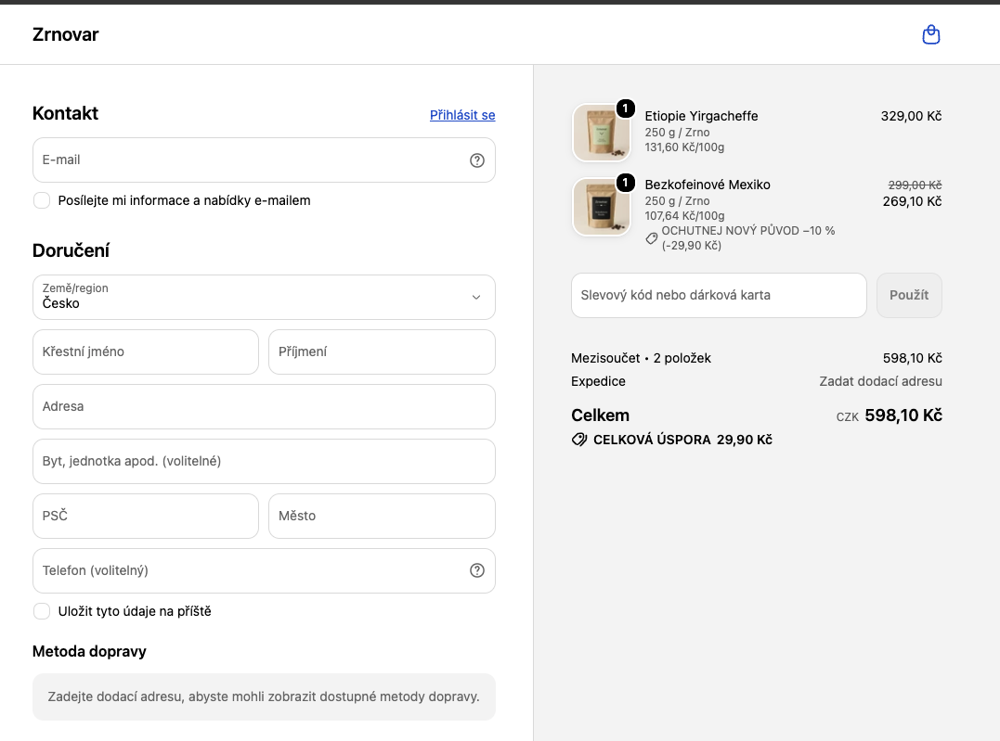

**Recenze produktu.** Recenze na detailu produktu z aplikace Judge.me s hodnocením a tlačítkem pro napsání nové recenze.

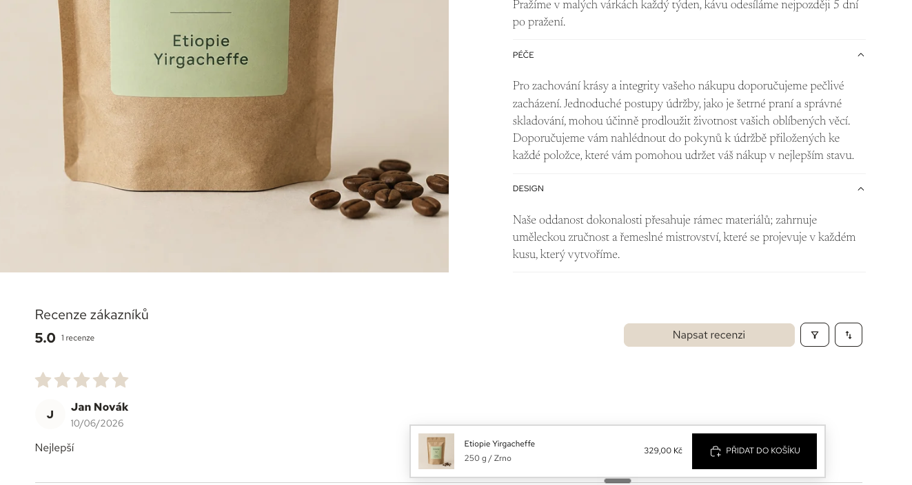

### Pohled B2B zákazníka

**Velkoobchodní ceny.** Po přihlášení firemního zákazníka se v celém obchodě zobrazují ceny z katalogu Velkoobchod Gastro, tedy o 15 % nižší. Brazílie Santos stojí 211,65 Kč místo 249 Kč.

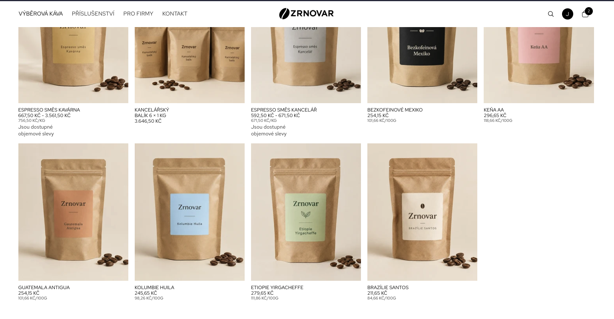

**B2B košík bez slevy.** Stejná situace jako u první ukázky, dvě různé kávy. B2B zákazník ale slevu „Ochutnej nový původ“ nedostane, protože má vlastní ceník.

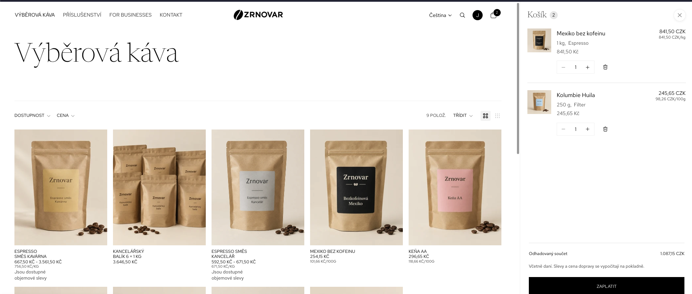

**Objemové slevy.** U vybraných produktů vidí B2B zákazník cenu podle odebraného množství. Čím víc balení, tím nižší cena za kus.

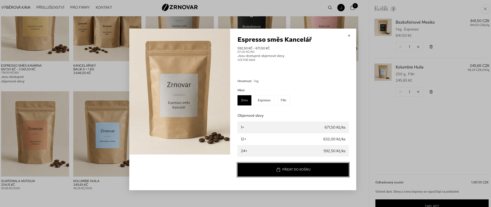

**Množstevní cena v košíku.** Při odběru 12 kg Espresso směsi Kavárna se cena za kilogram automaticky snížila z 756,50 Kč na 712 Kč.

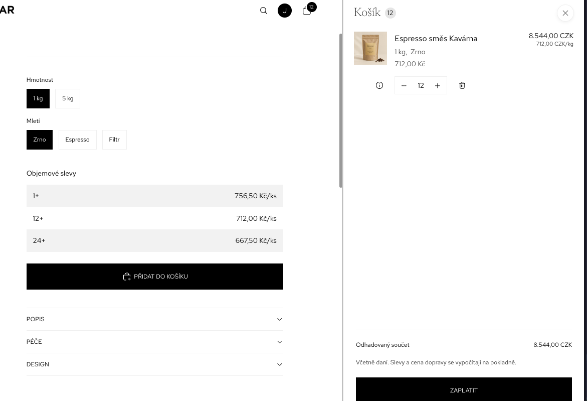

**Platba na fakturu.** B2B pokladna nabízí splatnost 30 dní. Dnes zákazník platí 0 Kč, celá částka je splatná 5. 11. I tady jsou dvě různé kávy bez slevy pro B2C.

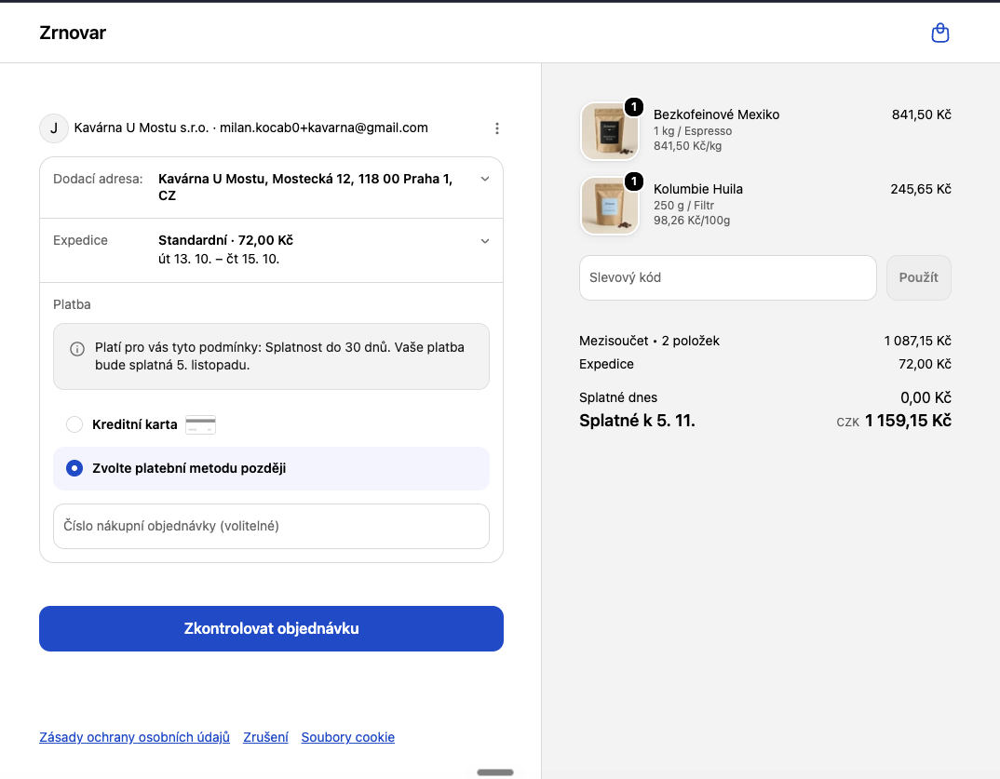

### Administrace

**Firma.** Kavárna U Mostu s.r.o. s jednou lokalitou, zákaznickým účtem a platebními podmínkami se splatností 30 dní.

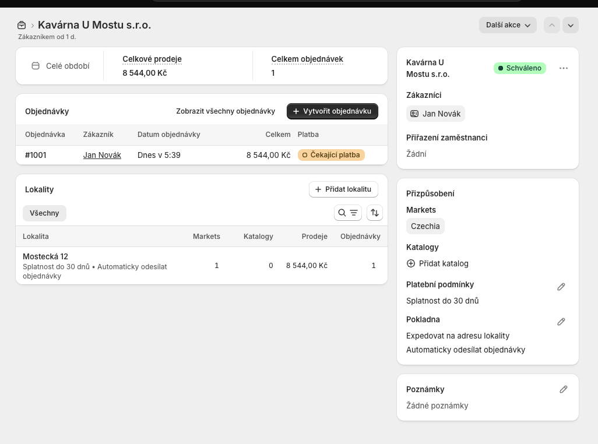

**B2B katalog.** Katalog Velkoobchod Gastro snižuje ceny všech produktů o 15 %. 

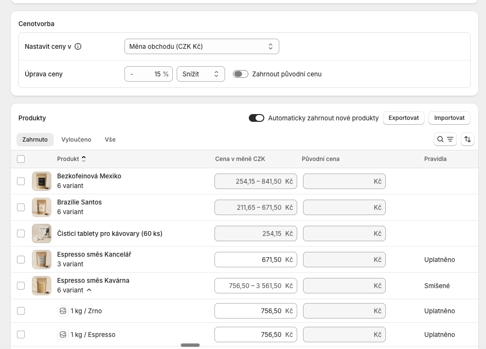

**Pravidla množství.** U Espresso směsi Kancelář je minimální odběr 6 kusů a dvě cenové hladiny, od 12 a od 24 kusů.

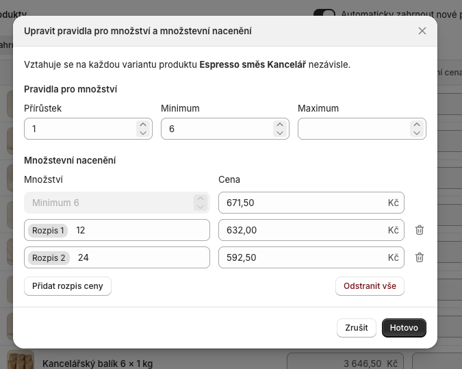

**Flow, docházející zboží.** Když zásoba varianty klesne pod 10 ks, workflow přidá produktu štítek `doobjednat` a pošle interní e-mail s názvem produktu.

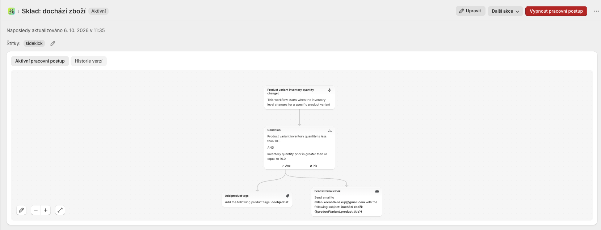

**Flow, velká B2B objednávka.** Když přijde objednávka od firmy v hodnotě alespoň 5 000 Kč, workflow jí přidá štítek `B2B-velka-objednavka` a pošle obchodníkovi e-mail.

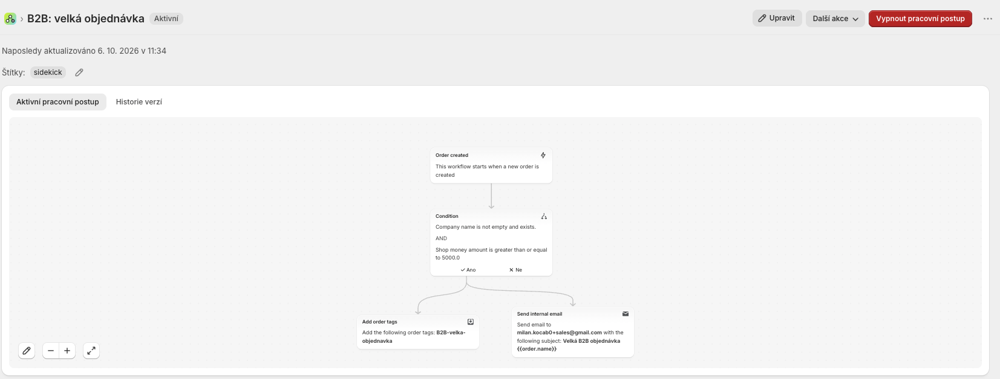

**B2B objednávka.** Objednávka 12 kg Espresso směsi Kavárna za množstevní cenu 712 Kč. Čeká na platbu se splatností 5. 11. 2026 a je přiřazená k firmě Kavárna U Mostu.

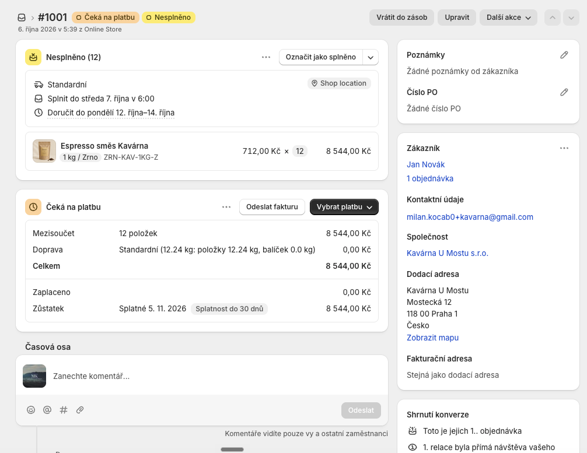

## Jak pracuji s AI

AI mi dělá rešerši, první verze a kód. O rozsahu, prioritách a výsledném řešení rozhoduji já a všechno ověřuji v obchodě.

- **Nastavení obchodu.** Při nastavování jsem se ptal Sidekicku přímo v administraci Shopify. Kde mi nestačil, doptal jsem se Claude.
- **Zadání.** Píšu ho v Claude projektu s vlastními instrukcemi, které určují strukturu zadání a styl. AI mi pomůže s první verzí a hledáním okrajových případů.
- **Vývoj.** Slevovou aplikaci napsal Claude Code přes Shopify CLI. Zadání jsem mu dal stejně jako vývojáři, tedy přesné pravidlo a testovací scénáře. Přes GraphiQL jsem pak v obchodě založil automatickou slevu a kontroloval data, se kterými funkce pracuje.
- **Kontrola.** Všechny scénáře jsem prošel v obchodě. Sleva funguje u dvou různých káv a neuplatní se u stejné kávy, u směsi ani u B2B zákazníka.
- **Prototyp.** U Stálé objednávky bych po konzultaci s vývojem připravil klikací prototyp v Claude Design nebo Figma Make. Klientovi bych ho představil, aby viděl, jak nad řešením uvažujeme, ještě před vývojem.

## Co jsem se naučil

- Administrace Shopify mi přijde přehledná a logicky uspořádaná, takže jsem se v ní rychle zorientoval. B2B, Flow i slevy jsem byl schopný nastavit bez vývojáře.
- Sidekick v administraci opravdu pomáhá. Většinu otázek k nastavení vyřešil rovnou.
- Kde končí nativní slevy a kdy dává smysl Shopify Function.

## Kontakt

Ing. Milan Kocáb
- [LinkedIn](https://www.linkedin.com/in/milan-kocab/)
- [milan.kocab0@gmail.com](mailto:milan.kocab0@gmail.com)
